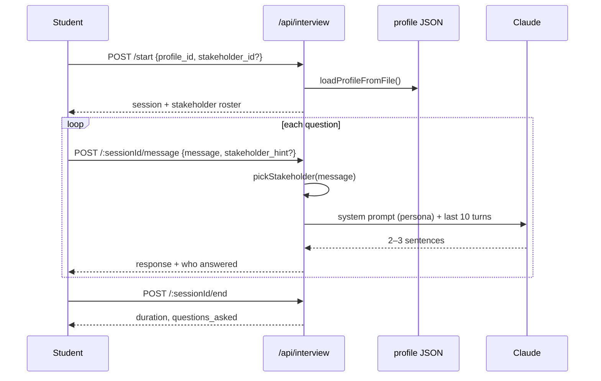

# 3.1.6 Interview Simulator

Stakeholder elicitation is the skill the rest of the engagement depends on, and
it's the one a static profile document can't teach. The interview simulator
puts the student in a conference room with the profile's stakeholders, played
by Claude.

Page: `/ciab/interview`. API:
[routes/interview.js](https://github.com/Saguaros-CyberHub/CyberCore/blob/main/front-end/modules/crucible/plugins/ciab/routes/interview.js)
at `/api/interview`.

## Sessions

Sessions live in `interview_sessions` with the full `transcript` as JSONB.
Each turn appends two entries (student, then stakeholder) and increments
`questions_asked`. Ending a session sets `status = 'completed'`, `ended_at`,
and computes `duration_seconds`.

Stakeholders come from the profile JSON on disk, not the database –
`loadProfileFromFile()` tries five candidate paths before giving up, which is
the accommodation for profiles created under different working directories.

## "All stakeholders" mode

If `stakeholder_id` is omitted or set to `'all'`, the session is a group
briefing: `stakeholder_name = 'All Stakeholders'`, `stakeholder_role =
'Group Briefing'`, and the first stakeholder anchors the row. On each message,
`pickStakeholder()` decides who answers.

The picker is keyword-based, most specific pattern first:

| Question mentions | Answered by roles matching |
|---|---|
| budget, cost, revenue, ROI, funding, insurance | cfo, finance, controller, accounting, treasurer |
| employees, training, onboarding, termination, hiring | hr, human, people, talent, personnel |
| compliance, HIPAA/PCI/SOX/GDPR/NIST/FERPA/NERC, audit, policy, privacy | compliance, legal, privacy, regulatory, governance, counsel |
| operations, workflow, supply, logistics, downtime, BC/DR | operation, coo, director, warehouse, logistics, plant, facilities |
| customer, sales, marketing, vendor, third-party, contract | sales, marketing, business develop, account, vendor |
| server, firewall, VPN, backup, patch, EDR, SIEM, MFA, ransomware, AD… | it, ciso, technology, security, information, sysadmin, network |
| strategy, mission, board, leadership, merger, org overview | ceo, owner, president, executive |

A caller-supplied `stakeholder_hint` short-circuits the keywords and matches by
role or name substring. If nothing matches, the picker rotates using
`question.length % stakeholders.length` — deliberately not "always the first
person", so the room feels populated.

## The persona prompt

`buildSystemPrompt()` assembles a persona from the stakeholder's profile
fields: `technical_fluency`, `communication_style`, `concerns` (top 2),
`likely_pushback` (top 2), `information_they_can_provide` (top 5), and
`information_they_lack` (top 3). It also lists who else is at the table.

The rules the prompt enforces are what make it a useful exercise rather than a
document dump:

- **2–3 short casual sentences, nothing more.** `max_tokens` is 256 to back
  this up.
- No bullets, headers, bold, or quotation marks.
- One topic per response.
- **Only answer what's asked** – reveal context gradually, make the student ask
  follow-ups.
- Say so when you don't know something.
- Everyone is in the room together; deflect with "Linda handles that", never
  "let me get Linda on the line".

Conversation history is trimmed to the last 10 turns. Stakeholder turns are
prefixed with `[Name]:` in the history so the model can tell who said what in
group mode.

!!! note "No prompt caching here"
    The system prompt embeds respondent-specific data, so only the boilerplate
    would be cacheable and `buildSystemPrompt` isn't split into static/dynamic
    halves. Interview latency is dominated by output tokens anyway. If someone
    refactors it, `llm.cachedSystem()` on the rules block is the win.

If the LLM call fails, `fallbackResponse()` returns one of three canned
in-character deflections rather than surfacing an error – the session stays
usable.

## Endpoints

| Endpoint | Purpose |
|---|---|
| `POST /api/interview/start` | Create a session; returns the stakeholder roster |
| `POST /api/interview/:sessionId/message` | Ask a question; returns the answer and who gave it |
| `POST /api/interview/:sessionId/end` | Close the session; returns duration and question count |
| `GET /api/interview/sessions/:profileId` | The caller's sessions for a profile |
| `GET /api/interview/stakeholders/:profileId` | Roster without starting a session |

All require `authenticateToken` and are scoped to `req.user.userId` – the
message and end routes match on `user_id` in their `WHERE` clauses, so one
student cannot drive another's session.

!!! warning "`quality_score` is not computed"
    `interview_sessions.quality_score` and `information_gathered` exist in the
    schema and are returned by the sessions list, but nothing in the API
    currently writes them. Treat them as reserved, not as data.

Continue to **[07 – Instructor Tools](07-instructor-tools.md)**.
