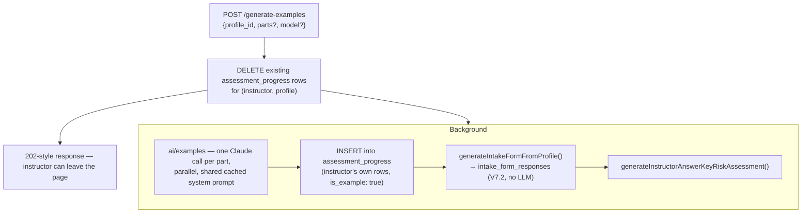

# 3.1.7 Instructor Tools

The instructor console at `/ciab/instructor` is backed by
[routes/instructor.js](https://github.com/Saguaros-CyberHub/CyberCore/blob/main/front-end/modules/crucible/plugins/ciab/routes/instructor.js)
– at ~2 500 lines the largest router in the plugin. Every route is gated by
`authenticateToken` + `instructorOnly` (instructor or admin).

It covers five areas: cohort visibility, assignment and review,
answer-key generation, artifact generation, and group / lane
management.

## The 8-part assessment

Student work is tracked in `assessment_progress`, one row per
`(user_id, profile_id, part_number)`, with `status` moving
`not_started → in_progress → submitted → reviewed`.

The part structure — numbers, names, options and deliverables — lives in
[utils/part-definitions.js](https://github.com/Saguaros-CyberHub/CyberCore/blob/main/front-end/modules/crucible/plugins/ciab/utils/part-definitions.js),
which exports `PART_DEFINITIONS`, `TOTAL_PARTS` and `getPartName()`:

| Part | Name | Options |
|---|---|---|
| 1 | Clinic Orientation | participation agreement, reflection |
| 2 | Organizational Understanding | org brief, scoping matrix, asset inventory, risk hypothesis, question log, scope diagram |
| 3 | Threat Identification | sector brief, actor profiles, case study, threat model, emerging threats, insider threats |
| 4 | Vulnerability Discovery | policy review, scanning, scan analysis, config assessment, vuln→asset map |
| 5 | Risk Analysis | scoring justification, likelihood/impact briefs, risk narrative, final package |
| 6 | Controls and Mitigations | framework selection, risk→control map, feasibility, roadmap, client package |
| 7 | Reporting and Communication | full report, executive summary, presentation, handoff |
| 8 | Reflection and Workforce Alignment | reflection paper, self-assessment, workforce alignment, career plan |

Each option lists its individual deliverables, which is what the answer-key
generator fans out over.

`instructor.js` and `progress.js` both import from this module, so the name
written into `assessment_progress.part_name` on student save matches what the
instructor UI and the answer-key generator display. That was not always true:
`progress.js` used to carry its own `getPartName()` with a different set of
names, and since it is the writer, stored labels disagreed with every reader.

Rows written before the merge still hold the old names, so
`GET /api/progress/:profileId` re-derives `part_name` from the part number
instead of returning the stored value. No backfill is needed, and a migration
would only be worth running if something starts querying `part_name` directly.

!!! note "The instructor page keeps its own short labels"
    `public/pages/instructor.html` has a browser-side `getPartName()` returning
    abbreviations ("Orientation", "Threats", "Vulnerabilities") for a UI chip
    where the full names don't fit. It is a display concern and never reaches
    the database, but keep it recognisable against the canonical list.

### Student-facing progress API

| Endpoint | Purpose |
|---|---|
| `GET /api/progress/:profileId` | All 8 parts, with un-started parts synthesized so the UI always gets 8 entries; enriched with reviewer email via a cross-DB lookup |
| `PUT /api/progress/:profileId/:partNumber` | Upsert content / option / evidence files. `COALESCE` on update means omitted fields keep their previous value |
| `POST /api/progress/:profileId/:partNumber/submit` | Flip to `submitted`, stamp `submitted_at`, increment `revision_count` |

The summary block returns `total_parts`, `started`, `submitted`, `reviewed`
and `avg_score`.

## Cohort visibility

`GET /api/instructor/dashboard` builds the roster. Users live in
`cybercore_db`, so it queries `cybercore_user` for all students, then joins
against `clinic_db` for profiles, `instructor_assignments`, and
`instructor_working_sets` — batched by student-id list rather than per-student.

| Endpoint | Purpose |
|---|---|
| `GET /api/instructor/dashboard` | Full roster with profiles, assignments, watch state, pending submissions |
| `GET /api/instructor/student/:studentId/progress` | One student's 8-part detail |
| `GET /api/instructor/students/search` | Find students to add |
| `POST /api/instructor/students/watch` | Add to the instructor's working set |
| `POST /api/instructor/claim-student` | Claim a student |
| `DELETE /api/instructor/release-student/:studentId` | Release a claim |

`instructor_working_sets` is a soft-delete table (`is_active`, `removed_at`)
with a partial index on active rows, so a student can be re-added without
losing history.

## Assignment and review

| Endpoint | Purpose |
|---|---|
| `POST /api/instructor/assign` | Assign a profile to a student with an optional due date (`instructor_assignments`) |
| `POST /api/instructor/review/:progressId` | Score and give feedback on a submission — sets `status='reviewed'`, `reviewer_id`, `feedback`, `score`, `rubric_scores` |
| `GET /api/instructor/rubric/:profileId` | The grading rubric for a profile |

`peer_reviews` exists in the schema for student-to-student review keyed on
`(submission_id, reviewer_id)`; it is not exercised by the current routes.

## Answer keys

`POST /api/instructor/generate-examples` is the biggest single operation the
console can trigger. It returns immediately with `status: 'generating'` —
the work runs in a `setImmediate` fire-and-forget block, tracked by an
in-memory job map polled through
`GET /api/instructor/generation-status/:profileId`.

The answer key is stored as the instructor's own `assessment_progress`
rows for that profile, with `is_example: true` inside the JSON content — which
is why regenerating deletes the instructor's prior rows first.

### The risk-assessment answer key

[utils/answer-key-risk-assessment.js](https://github.com/Saguaros-CyberHub/CyberCore/blob/main/front-end/modules/crucible/plugins/ciab/utils/answer-key-risk-assessment.js)
produces a complete, deterministic risk assessment the instructor can
compare student work against — no LLM call. From the profile plus its unified
intake it writes:

1. ~15–22 rows into `risk_findings`
2. all 56 `cis_ram_safeguards` rows plus the `cis_ram_assessments` envelope
3. an executive-summary narrative into `report_deliverables` (both free-form
   and the structured `exec_*` fields)
4. CSF maturity scores into `report_deliverables.csf_scores`
5. an asset register into `risk_assets`, with findings linked back via
   `affected_asset_ids`
6. an `insurance_readiness` scorecard derived from the profile

Findings are built by named generators (`f_mfa`, `f_backups_immutable`,
`f_no_siem`, `f_flat_network`, `f_no_ir_plan`, plus one per threat scenario and
one per deliberate weakness) that reference the profile's actual stakeholder
names, EDR product, and MFA coverage. Combined with the profile's posture
archetype, this makes each key genuinely profile-specific rather than
boilerplate.

It runs only if a unified `intakes` row with an `ig1` section exists — otherwise
it logs and skips, leaving the Part 1–8 examples intact.

## Artifact generation

| Endpoint | LLM? | Output |
|---|---|---|
| `POST /api/instructor/generate-documents` | no | nmap / nessus / zap into `generated_documents` (default all three) |
| `GET /api/instructor/download/:profileId/:docType` | – | One document |
| `GET /api/instructor/documents/:profileId` | – | List generated documents |
| `GET /api/instructor/packet/:profileId/pdf` | – | Instructor packet PDF: cover page, answer key by part, intake form |
| `GET /api/instructor/vuln-cheat-sheet/:profileId` | – | The vuln-app's attack chain, seed data, per-file annotations and instructor notes |
| `POST /api/profiles/:id/policies/generate` | yes | Policy documents (on the profiles router) |

Both document generators resolve the profile JSON by `json_file_path` first
and fall back to scanning `front-end/profiles/` for a filename containing the
`run_id` — an accommodation for profiles whose stored path doesn't match the
current working directory.

The vuln cheat sheet reads `ciab_profile_vuln_apps.generation_meta` for the
most recent row and returns 404 if no deploy has run yet. Older rows may lack
`file_annotations` or `seed_data`; the endpoint returns nulls and the UI
handles them.

## Groups, schedules, and lanes

Instructors manage the time windows enforced by the schedule middleware
([01](01-architecture.md)). A group is a `deployed_groups` row whose `config`
JSONB lists `students[]` and `instructors[]`; membership is resolved in JS, not
SQL.

| Endpoint | Purpose |
|---|---|
| `GET /api/instructor/my-groups` | Groups where the caller is listed as an instructor |
| `GET /api/instructor/all-groups` | All groups, flagged with whether the caller is in them |
| `POST /api/instructor/join-group` | Add self to a group's instructor list |
| `GET`/`PUT /api/instructor/groups/:id/schedule` | Read / set `active_days`, `active_start`, `active_end`, `timezone` |
| `PATCH /api/instructor/groups/:id/schedule/override` | Force a group open or closed, bypassing the time window |

Lane visibility is read-only plus one toggle:

| Endpoint | Purpose |
|---|---|
| `GET /api/instructor/lanes` | Lanes visible to this instructor |
| `GET /api/instructor/lanes/:id/ips` | Per-VM IPs for a lane |
| `GET /api/instructor/lanes/:id/connect` | Console / connection details |
| `PATCH /api/instructor/lanes/:id/internet` | Toggle a lane's internet access |

Creating and destroying lanes is admin-only and lives on the deploy router;
see [08 – Lane Deployment](08-lane-deployment.md).

Continue to **[08 – Lane Deployment](08-lane-deployment.md)**.
