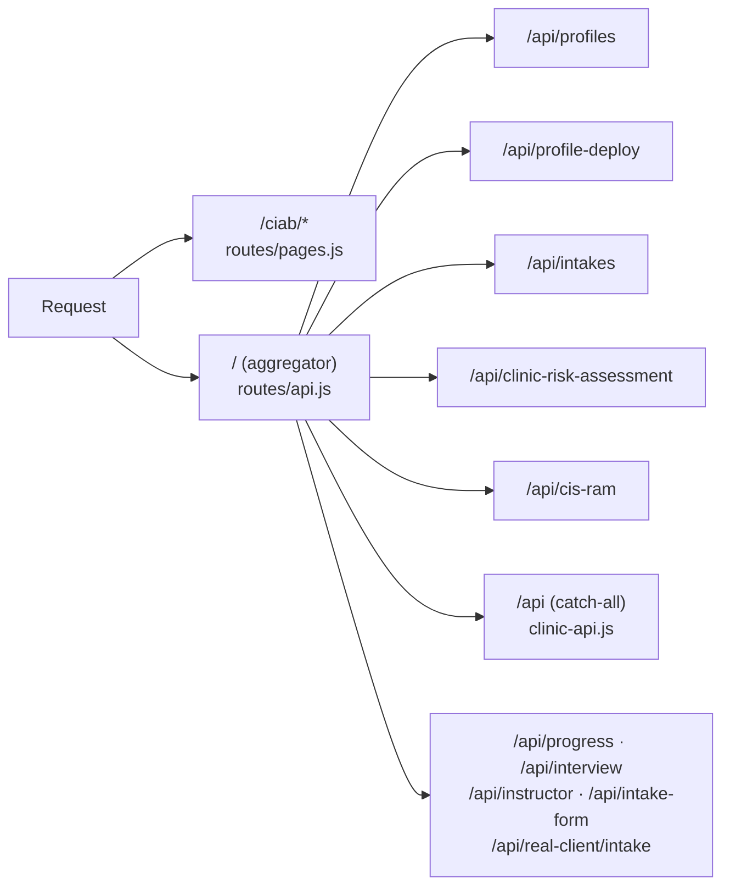
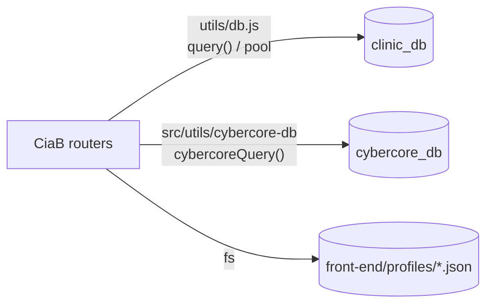

# 3.1.1 Architecture

How the plugin is wired into CyberCore: loading, routing, auth, data access,
and the on-disk layout. For the general loader mechanics see
[Overview / 04 – Modules & Plugins](../../01. Overview/04-modules-and-plugins.md).

## Directory layout

```
modules/crucible/plugins/ciab/
├── manifest.json          # key, mounts, database, subnav
├── ai/                    # LLM pipelines (no Express here)
│   ├── profile/           # client-org generation (A/B/C/D branches + render)
│   ├── policy/            # policy-document generation
│   ├── examples/          # instructor answer keys for Parts 1–8
│   ├── vuln-app/          # 3-stage vulnerable web-app generation
│   └── scan-documents/    # nmap/nessus/zap — deterministic, no LLM
├── data/
│   ├── frameworks/        # cis-ig1.json, nist-csf-2.0.json
│   └── threat-scenario-library.json
├── middleware/schedule.js # time-window access control for students
├── migrations/            # 001–007, run by the loader against clinic_db
├── public/                # pages/, js/, vendor/echarts.min.js
├── routes/                # Express routers
├── scripts/               # one-off maintenance (backfill-intakes.js)
├── test/                  # node:test unit tests + fixtures
└── utils/                 # pure logic + Proxmox orchestration
```

The split that matters: `ai/` and `utils/` hold the logic, `routes/` holds
only HTTP plumbing. Most of `utils/` is pure functions with no DB or IO
(`profile-to-spec.js`, `intake-normalizer.js`, `quant-risk.js`,
`ig1-derivation.js`, `pdf-helpers.js`, `part-definitions.js`), which is why
they have unit tests.
The exceptions are `db.js`, `lane-deploy.js`, `lane-networking.js`,
`vuln-app-builder.js`, and `vuln-app-generator.js`.

## Loading

The manifest declares two routers and one database:

```jsonc
"routes": [
  { "file": "routes/pages.js", "mountPath": "/ciab" },
  { "file": "routes/api.js",   "mountPath": "/"     }
],
"staticDir": "public",
"staticMountPath": "/ciab",
"database": { "name": "clinic_db", "migrations": "migrations" }
```

At boot the module loader creates `clinic_db` if it doesn't exist, runs every
`.sql` in `migrations/` in sorted order, then injects the connection pool into
the plugin via `setPool()` in
[utils/db.js](https://github.com/Saguaros-CyberHub/CyberCore/blob/main/front-end/modules/crucible/plugins/ciab/utils/db.js).
Nothing in the plugin opens its own connection – `require('./db').pool` is a
getter that returns whatever the loader injected, so requiring `db.js` at
module-load time is safe even before provisioning finishes.

## Routing

`routes/api.js` is mounted at `/` and is purely an aggregator: each sub-router
keeps the absolute `/api/...` path it had before the plugin split, so URLs
never changed when CiaB was extracted from the monolith.



### Mount order is load-bearing

Express matches `router.use()` prefixes in registration order. Any router with
unauthenticated routes must be mounted *before* the `/api` catch-all,
because the catch-all applies `authenticateToken` to everything it claims.

The concrete case: `/api/profile-deploy/image/:token` is deliberately public
and token-gated – lane web VMs pull their vuln-app image over it and have no
JWT. If `/api/profile-deploy` were registered after `/api`, the catch-all would
claim the request and reject it with a 401 before the deploy router ever ran.
The four specific-prefix mounts above the catch-all
(`/api/profiles`, `/api/profile-deploy`, `/api/intakes`,
`/api/clinic-risk-assessment`, `/api/cis-ram`) exist for this reason. Add new
routers above the catch-all unless you're certain every route in them
needs auth.

### HTML is never cached

`pages.js` sends every HTML page with `Cache-Control: no-cache, no-store,
must-revalidate` and with ETag/Last-Modified disabled. Pages carry inline JS
(e.g. the generator's progress poller); a 304-able copy from a previous deploy
silently keeps running old code, and some proxies skip the conditional GET
entirely. Static assets under `/ciab/js/` are cached normally.

## Authentication and authorization

Three layers, applied per-router:

| Layer | Where | Effect |
|-------|-------|--------|
| `authenticateToken` | `api.js` mounts, or `router.use()` inside a router | Requires a valid JWT; populates `req.user` |
| `requireRole('admin')` / `instructorOnly` | per-route | Hard role gate |
| Ownership check | inside handlers | Students see only their own rows |

The ownership pattern used by the risk-assessment and CIS RAM routers is worth
copying:

```js
function isPrivileged(req) {
  return req.user?.role === 'admin' || req.user?.role === 'instructor';
}

async function userCanReadProfile(userId, profileId, role) {
  if (role === 'admin' || role === 'instructor') return true;
  const r = await pool.query(
    `SELECT 1 FROM profiles WHERE id = $1 AND user_id = $2`, [profileId, userId]
  );
  return r.rowCount > 0;
}
```

Instructors and admins read any profile; students read only profiles they own.

## Schedule middleware

[middleware/schedule.js](https://github.com/Saguaros-CyberHub/CyberCore/blob/main/front-end/modules/crucible/plugins/ciab/middleware/schedule.js)
gates student API access to a time window defined by their group. It runs after
`authenticateToken` on almost every API mount.

- **Students only.** Instructors and admins always pass through.
- Looks up `deployed_groups` where the student's id appears in
  `config->'students'`, joined to `account_schedules`.
- **No group ⇒ no restriction.** Students not in any scheduled group pass.
- `override_active = true` forces open; `false` forces closed
  (`SCHEDULE_OVERRIDE_OFF`).
- Otherwise checks day-of-week against `active_days` and local time against
  `active_start`/`active_end` in the group's `timezone`
  (default `America/Chicago`), returning 403 with
  `SCHEDULE_WRONG_DAY` / `SCHEDULE_WRONG_TIME`.
- **Fails open.** Any error in the check calls `next()` – a broken schedule
  query never locks a class out.

Instructors manage these windows from the instructor console; see
[07 – Instructor Tools](07-instructor-tools.md).

## Data access

CiaB touches three stores:



- **`clinic_db`** – everything the plugin owns. `user_id` columns are plain
  UUIDs with no FK, because users live in `cybercore_db`.
- **`cybercore_db`** – read/written through `cybercoreQuery()` for
  `crucible_challenge`, `cybercore_lane`, `cybercore_template_catalog`, and
  user lookups. Migrations in this plugin cannot `ALTER` those tables, so
  linkage tables (`ciab_profile_lane_groups`, `ciab_profile_lane_jobs`) live in
  `clinic_db` and store `lane_id` / `challenge_id` as bare UUIDs.
- **Disk** – the full profile document. `profiles.json_file_path` stores a
  path like `profiles/client_profile_RUN_….json`, resolved against
  `process.cwd()`. Handlers that need network assets, stakeholders, or the IT
  environment read the file; the row only carries the summary columns.

!!! warning "Table names that exist in both databases"
    `deployed_groups`, `account_schedules`, `generated_documents`,
    `instructor_working_sets`, and `vuln_scripts` exist in both
    `clinic_db` and `cybercore_db` – an artifact of the CiaB→CyberCore split.
    CiaB code reads the `clinic_db` copies through `utils/db.js`. When
    debugging with `psql`, confirm which database you're connected to before
    concluding a row is missing.

## LLM access

Every AI call goes through
[src/utils/llm-client.js](https://github.com/Saguaros-CyberHub/CyberCore/blob/main/front-end/src/utils/llm-client.js) –
the plugin never talks to a provider SDK directly. The client provides:

- `generate()` / `generateJson()` – single call, with JSON repair for
  truncation and escaping bugs.
- `generateParallel()` – fan-out capped by a global concurrency semaphore.
- `cachedSystem()` – marks a system prompt for provider-side prompt caching, so
  a batch of calls sharing one system prompt pays full input cost once.

Model selection is per-call; costs are estimated up front by
[utils/cost-estimator.js](https://github.com/Saguaros-CyberHub/CyberCore/blob/main/front-end/modules/crucible/plugins/ciab/utils/cost-estimator.js).
When `ANTHROPIC_API_KEY` is absent, the vuln-app path falls back to a
hardcoded template so local development still works end-to-end; the profile
generator does not have such a fallback.

Continue to **[02 – Profile Generation](02-profile-generation.md)**.
