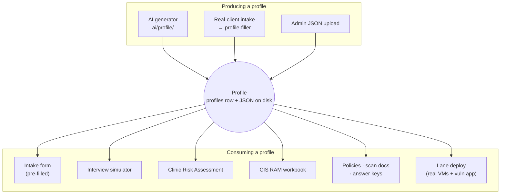

# 4.11.1 CiaB Overview

Clinic-in-a-Box is CyberCore's AI-powered cyber risk-assessment training
platform. Students act as consultants running a security engagement for a
client organization – either an AI-generated simulated one, or a real
organization whose intake was uploaded and anonymized.

It is the largest plugin in the platform (~35k lines) and is historically the
origin of the CyberCore front-end. This section documents it in full; the
one-page summary lives in
[4.10 – Plugins](../10-plugins.md).

## At a glance

| | |
|---|---|
| Key | `ciab` |
| Lives in | [modules/crucible/plugins/ciab/](https://github.com/Saguaros-CyberHub/CyberCore/tree/main/front-end/modules/crucible/plugins/ciab/) |
| Parent module | `crucible` |
| Database | `clinic_db` (7 migrations, ~30 tables) |
| Page mount | `/ciab` |
| API mount | `/` – each sub-router registers its own `/api/*` prefix |
| Static mount | `/ciab` |
| Entry URL | `/ciab/dashboard` |
| Roles | student · instructor · admin (per-route) |

## The mental model

CiaB revolves around one object: the profile. A profile is a complete,
internally-consistent fictional (or anonymized real) client organization –
org chart, IT environment, network assets, threat model, governance posture.
Everything else in the plugin is either something that *produces* a profile or
something that *consumes* one.

The profile row lives in `clinic_db.profiles`, but the *full* profile document
is a JSON file on disk under `front-end/profiles/`, referenced by
`profiles.json_file_path`. Most consumers load that file, not the row – a
detail that matters constantly when debugging.

## Reading order

| # | Doc | What it covers |
|---|-----|----------------|
| 4.11.1 | [Architecture](02-architecture.md) | How the plugin loads, routes, authenticates, and reaches its data. Start here. |
| 4.11.2 | [Profile Generation](03-profile-generation.md) | The AI pipeline that builds a client organization from a handful of knobs. |
| 4.11.3 | [Intakes](04-intakes.md) | The unified intake schema, the two legacy schemas it replaced, and the real-client upload flow. |
| 4.11.4 | [Clinic Risk Assessment](05-risk-assessment.md) | The main student deliverable: risk register, assets, scenarios, quantification, PDF export. |
| 4.11.5 | [CIS RAM Workbook](06-cis-ram.md) | The CIS RAM v2.1 IG1 workbook mirrored into the database. |
| 4.11.6 | [Interview Simulator](07-interview-simulator.md) | AI stakeholder role-play. |
| 4.11.7 | [Instructor Tools](08-instructor-tools.md) | Dashboard, assignments, answer keys, scan documents, groups and schedules. |
| 4.11.8 | [Lane Deployment](09-lane-deployment.md) | Turning a profile into N real Proxmox lanes, plus the AI vuln-app pipeline. |
| 4.11.9 | [Data Model](10-data-model.md) | `clinic_db` table reference. |
| 4.11.10 | [API Reference](11-api-reference.md) | Every endpoint, its mount path, and its auth level. |

## Page map

Pages are served by [routes/pages.js](https://github.com/Saguaros-CyberHub/CyberCore/blob/main/front-end/modules/crucible/plugins/ciab/routes/pages.js);
the sidebar entries come from the `subnav` block in
[manifest.json](https://github.com/Saguaros-CyberHub/CyberCore/blob/main/front-end/modules/crucible/plugins/ciab/manifest.json).

| Path | Page | Audience |
|------|------|----------|
| `/ciab/dashboard` | Landing / profile browser | all |
| `/ciab/generator` | Generate a new AI profile | all |
| `/ciab/workspace` | The 8-part assessment workspace | student |
| `/ciab/intake` · `/ciab/intake-form` | Intake questionnaire (dual-mode) | student |
| `/ciab/clinic-risk-assessment[/:profileId]` | Risk assessment SPA | student |
| `/ciab/clinic-risk-assessment/:profileId/report` | Print-ready HTML report | student |
| `/ciab/interview` | Stakeholder interview simulator | student |
| `/ciab/progress` | Per-part progress | student |
| `/ciab/guide` · `/ciab/nice-framework` | Reference material | all |
| `/ciab/real-client-intakes` · `/ciab/real-client-intake[/:id]` | Real-client intake list / detail | instructor · admin |
| `/ciab/real-client-intake/:id/synthesize` | Challenge-spec review | instructor · admin |
| `/ciab/instructor` | Instructor console | instructor · admin |
| `/ciab/admin-profile-lanes` | Deploy lanes from a profile | admin |

!!! note "Docs vs. code"
    If something here disagrees with the code, the code wins – open a PR to fix
    the doc. Line references are omitted deliberately; file references are not.
