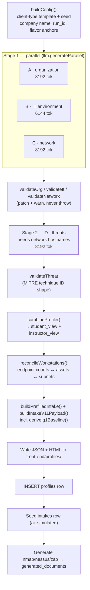

# 4.11.2 Profile Generation

A profile is a complete fictional client organization: org chart and
stakeholders, IT environment, network assets and subnets, threat model,
governance posture, and a set of deliberate weaknesses for the student to find.
Generating one is the single most expensive operation in the plugin, and the
one everything else depends on.

Entry point:
[ai/profile/index.js](https://github.com/Saguaros-CyberHub/CyberCore/blob/main/front-end/modules/crucible/plugins/ciab/ai/profile/index.js)
→ `generateProfile({ user_id, ...config })`.

## The pipeline



Stage 1 runs A, B and C concurrently. D is sequential because its prompt
embeds a summary of the network branch's actual hostnames – threat scenarios
have to reference assets that exist.

### Why the branches are split

One giant prompt produced profiles that were internally inconsistent and
visibly identical across runs. Splitting into four narrower prompts lets each
one be validated independently, and the four system prompts are marked with
`llm.cachedSystem()` – so a second profile generated within the cache window
pays roughly 10% of input cost on the system blocks.

Convergence (every generated company looking the same) is fought with:

- **Deterministic seeds** – company name, stakeholder names and `run_id` are
  derived from the seed, not asked of the model.
- **Flavor anchors** – `buildFlavorBundle(run_id)` injects a vendor bias,
  hostname theme, EDR product, firewall vendor, and threat-actor archetype into
  each branch's user prompt.
- **High temperature** – `0.9` by default, `0.95` for the organization branch.

## Configuration

`buildConfig()` resolves a client-type template plus caller overrides. The
four templates and their default engagement hours (from `GET /api/config`):

| `client_type` | Name | Hours | Default industries |
|---|---|---|---|
| `SMB` | Small-Medium Business | 8 | Professional Services, Retail, Manufacturing |
| `NonProfit` | Non-Profit Organization | 6 | – |
| `Utility_IT_OT` | Utility Company (IT/OT) | 12 | – |
| `K12` | K-12 School District | 8 | – |

Each template carries default `risks`, `compliance`, `criticalSystems`, and a
NAICS hint. Other knobs the generator form exposes:

| Field | Notes |
|---|---|
| `difficulty` | `beginner` · `intermediate` · `advanced` |
| `maturity` | `Low` · `Intermediate` · `High` |
| `delivery` | `On-Premises` · `Hybrid` · `Cloud` |
| `employees` | number or `{min, max}` |
| `stakeholder_count` | number or `{min, max}` (default 5) |
| `endpoint_count` / `endpoint_range` | defaults to ~0.8–1.5× average employees |
| `firewall_rules_range`, `weakness_range` | control artifact volume and how many deliberate weaknesses are planted |
| `cooperation`, `scaffolding` | affect the interview simulator's helpfulness and how much guidance the workspace shows |
| `company_name`, `domain`, `hq_city`, `framework` | explicit overrides |
| `custom_seed`, `custom_config` | escape hatches |

## Validation and autofill

[ai/profile/validators.js](https://github.com/Saguaros-CyberHub/CyberCore/blob/main/front-end/modules/crucible/plugins/ciab/ai/profile/validators.js)
handles *business* validation – generic JSON repair (truncation, bad escapes,
unbalanced brackets) already happened inside `llm-client`. Validators log
warnings and patch obvious gaps; they never throw.

| Branch | Checks / patches |
|---|---|
| A – organization | `department_breakdown` must sum to the target employee count; the difference is absorbed into `Other` |
| B – IT | duplicate servers dropped by hostname; bare OS strings (no version) flagged |
| C – network | subnet/asset shape |
| D – threats | MITRE technique IDs must match `T####` or `T####.###` |

If the threat branch refuses to comply (returns `{error: 'cannot_comply'}`),
generation continues with an empty threat profile rather than failing.

## Workstation reconciliation

[ai/profile/reconcile-workstations.js](https://github.com/Saguaros-CyberHub/CyberCore/blob/main/front-end/modules/crucible/plugins/ciab/ai/profile/reconcile-workstations.js)
rebuilds the workstation asset list so it matches the IT branch's declared
endpoint counts, distributed across the network branch's real subnets, and
filtered for industry realism – kiosks only for retail/hospitality/clinical
settings, macOS only for creative/tech shops, mobile only where fieldwork is
plausible. Counts removed by filtering are redistributed to desktops.

!!! warning "Order matters here"
    This used to run only at HTML-render time, so the report self-corrected for
    display while the saved JSON kept the un-reconciled numbers – and every
    other consumer (intake pre-fill, policies, interview, deploy console) read
    the JSON. It now runs once, before intake pre-fill, mutating the same
    object references the combined profile holds. If you move it, the intake
    form and the HTML will silently disagree again.

## The IG1 baseline

[utils/ig1-derivation.js](https://github.com/Saguaros-CyberHub/CyberCore/blob/main/front-end/modules/crucible/plugins/ciab/utils/ig1-derivation.js)
produces a `yes` / `partial` / `no` answer for each CIS Controls v8 IG1
safeguard, plus evidence notes. It is deterministic and pure – a function
of the profile's declared IT facts plus a hash of `run_id`.

Each answer is grounded in something a student can point to in the profile:

- declared controls (EDR product, patch cadence, MFA coverage, backup regime)
- the maturity level
- vendor flavor (a Microsoft-heavy shop plausibly has BitLocker and Intune)
- deliberate weaknesses – each one flips one or two specific safeguards to `no`
- a posture archetype hashed from `run_id`, so two SMBs at the same maturity
  don't score identically (one has great backups but no MFA, another has mature
  policy but weak endpoint security)

Because it's pure, the policy generator calls it again later and reproduces the
exact same answers – so generated policies never contradict what the risk
assessment says is true about the company.

## Outputs

A successful run produces, in order:

1. **`front-end/profiles/client_profile_<run_id>_<slug>.json`** – the full
   combined document (`student_view`, `instructor_view`, `config`, `seed`,
   `prefilled_intake_form`).
2. **`…​.html`** – standalone client-profile report rendered by
   [ai/profile/render.js](https://github.com/Saguaros-CyberHub/CyberCore/blob/main/front-end/modules/crucible/plugins/ciab/ai/profile/render.js).
   Student-facing only; no answer keys or weaknesses. A render failure is
   logged and does not fail generation – the JSON is already saved.
3. **A `profiles` row** with `generation_status = 'complete'` and
   `json_file_path` / `html_file_path` stored with a leading slash
   (`/profiles/…`) so links resolve from the site root, not from `/ciab/`.
4. **An `intakes` row** (`source = 'ai_simulated'`, schema `1.1`,
   `status = 'complete'`) carrying the pre-filled IG1 baseline, so the risk
   assessment has data on first open.
5. **Three `generated_documents` rows** – nmap, nessus and zap scan output,
   generated deterministically (see below).
6. **A sixth `generated_documents` row of type `policies`** – written twice:
   once up front with `metadata.status = 'generating'`, then again with the
   finished set.

Steps 4 and 5 are best-effort: a failure logs a warning and leaves the profile
intact.

Step 6 is different. Policy generation is 3–6 real Claude calls and can take a
minute or more, so it runs in a fire-and-forget async block that
`generateProfile()` deliberately does not await. The function returns as soon
as the row is inserted, and policies land shortly after. The placeholder row is
written before the first Claude call so a student who opens Policies mid-run
sees an accurate "still generating" state rather than an empty result that
invites a duplicate manual generation. Terminal states are
`metadata.status` of `complete`, `none` (nothing applicable for this profile),
or `failed`.

!!! note "Consequence for tests and cost accounting"
    A single profile generation fires more than the four branch calls. Anything
    counting LLM calls or estimating spend has to account for the background
    policy batch as well.

## Scan documents are not AI-generated

[ai/scan-documents/](https://github.com/Saguaros-CyberHub/CyberCore/tree/main/front-end/modules/crucible/plugins/ciab/ai/scan-documents/)
produces NMAP Markdown, Nessus XML and ZAP HTML with no LLM call – pure JS,
sub-second, no API cost. Every port and finding traces back to a
`profile.assets[].services` token.

That constraint is the whole point: the earlier generators always emitted
MS17-010, BlueKeep and friends regardless of what the profile declared, so the
moment a student ran a real `nmap` against the deployed lane the fake report
was obviously fake. Only assets with `role` of `server` or `network` are
scanned – the same filter the deploy orchestrator uses, so the report can't
include hosts that don't exist.

## Generating a profile over HTTP

```http
POST /api/profiles/generate
{ "client_type": "K12", "difficulty": "intermediate", "employees": 220,
  "progress_id": "gen-1730-abc" }
```

Generation runs inline (not queued), so the request is long-lived. Pass a
`progress_id` and poll:

```http
GET /api/profiles/run-status/gen-1730-abc
→ { step, percent, message, run_id, profile_id, error }
```

The progress entry is registered *before* work starts, so a fast validation
failure still shows up as `step: "error"` rather than 404-looping the poller.
Steps run `start → branches_parallel → branches_done → threats → combining →
intake_prefill → writing_files → seeding_intake → generating_documents →
complete`.

Related endpoints:

| Endpoint | Auth | Purpose |
|---|---|---|
| `POST /api/generate` | user | Backward-compatible alias that forwards to the same generator |
| `POST /api/profiles/upload` | admin | Register an existing profile JSON (raw JSON body, 20 MB limit – not multipart) |
| `POST /api/profiles/generate-and-deploy` | admin | One-step generate then deploy lanes ([08](09-lane-deployment.md)) |

## Cost

[utils/cost-estimator.js](https://github.com/Saguaros-CyberHub/CyberCore/blob/main/front-end/modules/crucible/plugins/ciab/utils/cost-estimator.js)
holds published per-million-token pricing per model plus measured average
token usage from real runs (rounded up ~10% so previews show a conservative
ceiling). It powers the cost preview next to the model picker on the generator
page and the pre-flight estimate on the deploy console.

The default model is `claude-sonnet-4-5`; Opus, Haiku, Gemini and local Ollama
models are also priced (Ollama at zero marginal cost).

!!! note "The frontend mirrors these constants"
    There is no shared bundler yet, so `generator.html` and
    `admin-profile-lanes.js` each carry a small inline copy of the pricing
    table. Change all three together.

## Derived artifacts

Once a profile exists, three more generators can run against it:

| Artifact | Module | LLM? | Trigger |
|---|---|---|---|
| Policy documents | [ai/policy/](https://github.com/Saguaros-CyberHub/CyberCore/tree/main/front-end/modules/crucible/plugins/ciab/ai/policy/) | yes (parallel fan-out, shared cached system prompt) | automatic in the background at generation; `POST /api/profiles/:id/policies/generate` to re-run |
| Scan documents | [ai/scan-documents/](https://github.com/Saguaros-CyberHub/CyberCore/tree/main/front-end/modules/crucible/plugins/ciab/ai/scan-documents/) | no | auto at generation; `POST /api/instructor/generate-documents` |
| Answer keys (Parts 1–8) | [ai/examples/](https://github.com/Saguaros-CyberHub/CyberCore/tree/main/front-end/modules/crucible/plugins/ciab/ai/examples/) | yes | `POST /api/instructor/generate-examples` |
| Vulnerable web app | [ai/vuln-app/](https://github.com/Saguaros-CyberHub/CyberCore/tree/main/front-end/modules/crucible/plugins/ciab/ai/vuln-app/) | yes (3 stages) | first lane deploy ([08](09-lane-deployment.md)) |

Policies are walked from `governance.policies_present`, generated in parallel,
stripped of `<think>` blocks and code fences, then wrapped in a corporate HTML
template. They embed the IG1 baseline so they stay consistent with the risk
assessment.

Continue to **[03 – Intakes](04-intakes.md)**.
