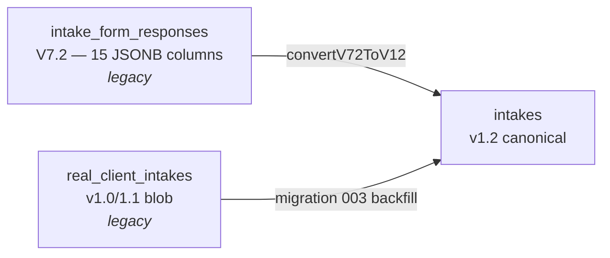
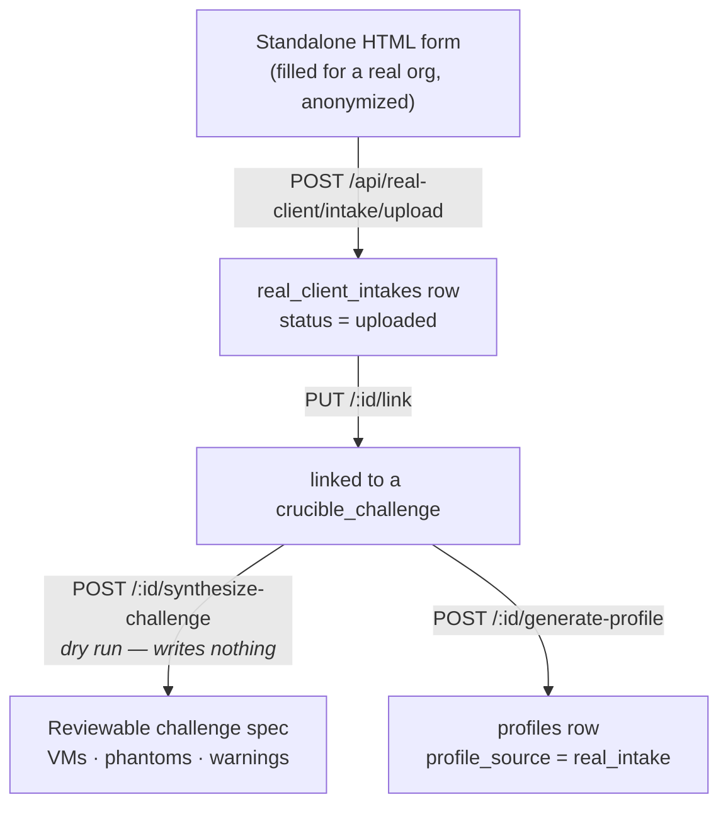

# 4.11.4 Intakes

The intake is the structured questionnaire that captures what an organization
actually has: network, endpoints, email, access control, data handling,
vulnerability management, and 56 CIS IG1 safeguard answers. It is the input to
the [Clinic Risk Assessment](05-risk-assessment.md).

There are two ways an intake comes into being:

- **AI-simulated** – the profile generator writes a pre-filled intake at
  generation time, and the student verifies and corrects it.
- **Real client** – someone fills out the standalone HTML form for a real
  organization, anonymizes it, and uploads the export.

## Three schemas, one canonical table

Intake storage has been through three generations. All three tables still
exist; only one is canonical.



| Table | Schema | Migration | Status |
|---|---|---|---|
| `intake_form_responses` | V7.2 – one JSONB column per section (15 of them) | 001 | Legacy. Still written by the instructor answer-key path; still read by the instructor packet PDF. |
| `real_client_intakes` | v1.0/1.1 – whole payload in one `payload` JSONB | 002 | Legacy. Still the table the real-client routes read and write. |
| `intakes` | v1.2 – one `payload` JSONB, unified envelope | 003 | Canonical. Everything new reads this. |

Migration 003 backfilled `real_client_intakes` into `intakes` (idempotently,
keyed on `legacy_source_table` + `legacy_source_id`). The V7.2 rows are
converted on demand by
[utils/intake-v72-to-v11.js](https://github.com/Saguaros-CyberHub/CyberCore/blob/main/front-end/modules/crucible/plugins/ciab/utils/intake-v72-to-v11.js)
(the filename says v11; the module's `SCHEMA_VERSION` is `1.2`).

There is one intake per profile, enforced by a partial unique index on
`intakes(profile_id) WHERE profile_id IS NOT NULL`. An intake with a null
`profile_id` is a standalone upload not yet attached to anything.

## The canonical payload

```jsonc
{
  "schema_version": "1.2",
  "cover_name": "Northgate Family Dental",   // anonymized org name
  "sections": {
    "company":    { "cover_name": "…", "employees_band": "51-100", … },
    "network":    { "server_count": 4, "workstation_count": 60, "segments": [ { "cidr": "10.10.0.0/24" } ], … },
    "wireless":   { … },
    "endpoint":   { … },
    "email_web":  { … },
    "access":     { … },
    "data":       { … },
    "vuln_audit": { … },
    "ig1":        { "ig1_1.1": "yes", "ig1_1.2": "partial", … },   // 56 keys
    "notes":      { … }
  }
}
```

Accepted `schema_version` values are `1.0`, `1.1` and `1.2`. Validation is
strict on the envelope (must be an object, must have `schema_version` and
`sections`) and permissive on field-level structure, because autosave fires
mid-edit. Payloads are capped at 4 MB.

### Completion percentage

`computeCompletion()` walks every leaf in `sections` and counts filled vs.
total. The rule that trips people up: `false` counts as filled. A
deliberately-unchecked box is a recorded answer. `null`, `undefined`, `''`,
`[]` and `{}` count as unfilled.

### Summary

List endpoints return a small summary instead of unmarshalling every payload:

```jsonc
{ "asset_total": 64, "ig1_answered": 41, "ig1_total": 56, "ig1_coverage_pct": 73 }
```

`asset_total` prefers `network.endpoint_count` when set, otherwise
`workstation_count + laptop_count`, plus `server_count`.

## The unified API

Mounted at `/api/intakes`; auth applied inside the router.

| Endpoint | Purpose |
|---|---|
| `GET /api/intakes` | List (own, or all when instructor/admin) |
| `GET /api/intakes/:profileId` | Fetch by profile – lazily creates an empty v1.2 intake if none exists |
| `PUT /api/intakes/:profileId` | Autosave; recomputes completion |
| `POST /api/intakes/:profileId/complete` | Mark complete |
| `GET /api/intakes/by-id/:intakeId` | Fetch a standalone intake |
| `PUT /api/intakes/by-id/:intakeId/attach` | Attach a standalone intake to a profile |
| `DELETE /api/intakes/by-id/:intakeId` | Delete |
| `POST /api/intakes/upload` | Upload an exported payload as a standalone intake |
| `GET /api/intakes/:profileId/export` | PDF export via `utils/pdf-helpers.js` |

The lazy-create on `GET /:profileId` handles profiles that pre-date
unification and never ran through the generator path that seeds an intake. It
infers `source` from `profiles.profile_source` (`real_intake` → `real_client`,
anything else → `ai_simulated`).

The legacy routers are still mounted alongside it: `/api/intake-form`
(V7.2 columns) and `/api/real-client/intake` (blob table).

## The dual-mode form page

`/ciab/intake` and `/ciab/real-client-intake` serve the *same* HTML file,
`real-client-intake.html`, in two modes:

- `?profileId=<uuid>` – bound to a profile, autosaves through `/api/intakes`.
- no parameter – standalone; the user fills it out and exports/uploads.

## The real-client flow



Uploads store the full `payload`, the first 4 KB of the raw upload as
`raw_preview` for audit, and `raw_format` (`json` or `html`). Students see only
their own uploads; instructors and admins see all. Only schema version `1.0` is
accepted by this legacy endpoint.

### Synthesizing a challenge spec

`POST /api/real-client/intake/:id/synthesize-challenge` is a dry run – it
normalizes the intake, resolves VM templates and vulnerability scripts, and
returns a spec for the admin to review before anything is created.

[utils/intake-normalizer.js](https://github.com/Saguaros-CyberHub/CyberCore/blob/main/front-end/modules/crucible/plugins/ciab/utils/intake-normalizer.js)
does the pure part: it maps server roles to the services they imply
(`dc` → SMB/LDAP/DNS, `file` → SMB, `mail` → SMTP, `web` → HTTP, `db` → SQL),
recognizes hosted email providers so a Google Workspace shop doesn't get a
phantom mail server, canonicalizes service tokens, and reconciles declared OS
counts against the total device count.

The response shape:

```jsonc
{
  "cover_name": "…",
  "suggested_challenge_key": "…",
  "vms": [ { "name": "dc01", "role": "dc", "os_family": "windows_server",
             "template_vmid": 1701, "template_match": "exact",
             "services": ["SMB","LDAP","DNS"],
             "default_scripts": [...], "missing_scripts": [...] } ],
  "phantom_assets": [ { "hostname": "ws05", "role": "workstation", "os": "macOS 14", "notes": "…" } ],
  "warnings": [ { "code": "…", "msg": "…" } ],
  "stats": { "deployable_vms": 7, "phantoms": 42, "warnings": 3 }
}
```

### Phantom substitution

A phantom is an asset the intake declares that can't become a real VM –
usually because no template matches its OS. Phantoms still appear in the
profile JSON and generated documents; they just never deploy.

Admins can substitute a phantom for a deployable VM of a different OS family:

| Substitution type | Result |
|---|---|
| `phantom` | No VM (default for Linux and unknown families) |
| `linux-workstation` | Linux workstation, SSH |
| `linux-server` | Linux server, SSH |
| `windows-workstation` | Windows client, SMB + RDP |
| `windows-server` | Windows Server, SMB + RDP |

The default policy substitutes macOS → `linux-workstation` (there is no
macOS template) and leaves everything else phantom unless the admin opts in.
Per-row overrides go in the request body as
`{ "substitutions": { "ws05": "linux-workstation", "ws07": "phantom" } }`.

### Generating a profile from a real intake

`POST /api/real-client/intake/:id/generate-profile` (instructor/admin) is
deterministic – no AI calls.
[utils/profile-filler.js](https://github.com/Saguaros-CyberHub/CyberCore/blob/main/front-end/modules/crucible/plugins/ciab/utils/profile-filler.js)
assembles a `student_view` from three inputs:

1. the anonymized intake payload,
2. the deployed `crucible_challenge.spec` – the VMs that are actually real,
3. admin-specified filler counts by asset type
   (`{ windows_desktop: 40, windows_laptop: 80, printer: 6, … }`).

Filler assets get plausible hostnames, OS strings and IPs allocated from the
intake's declared subnet (falling back to `10.200.0.0/16`), but they exist only
in the JSON and documents – fillers are never deployed. The resulting
profile row carries `profile_source = 'real_intake'`, `client_type =
'real_client'`, and `source_intake_id` pointing back at the intake, which is
flipped to `status = 'linked'`.

Continue to **[04 – Clinic Risk Assessment](05-risk-assessment.md)**.
