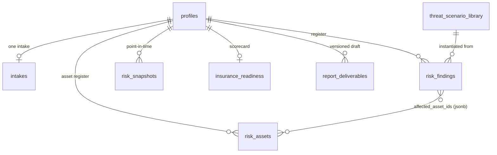

# 4.11.5 Clinic Risk Assessment

The Clinic Risk Assessment (CRA) is the plugin's flagship deliverable: a full
risk-assessment workspace built on top of a profile's intake. It's a
single-page app at `/ciab/clinic-risk-assessment/:profileId`, backed by
[routes/clinic-risk-assessment.js](https://github.com/Saguaros-CyberHub/CyberCore/blob/main/front-end/modules/crucible/plugins/ciab/routes/clinic-risk-assessment.js)
at `/api/clinic-risk-assessment`.

The feature set was built in tiers, and the code still uses that vocabulary:

| Tier | Adds |
|---|---|
| Phase 1 | Risk findings register, CSF maturity, IG1 coverage, PDF export |
| Tier 1 | Asset register, threat-scenario library, owner/due-date/evidence on findings |
| Tier 2 | POA&M export, insurance readiness, snapshot comparison |
| Tier 3 | OWASP decomposed scoring, FAIR-lite quantification |

## Data model



`threat_scenario_library` is system-wide – not scoped to a profile. Everything
else is scoped by `(profile_id, user_id)` so an instructor's answer key and a
student's work can coexist on the same profile without colliding.

## Getting in

The landing page uses `GET /api/clinic-risk-assessment/pickable`, which returns
both AI profiles and real-client intakes so the picker can offer either. An
intake already attached to a profile surfaces that `profile_id` for a direct
deep-link.

An unattached real-client intake is promoted with
`POST /api/clinic-risk-assessment/from-intake/:intakeId`, which creates a
`profiles` row (`profile_source = 'real_intake'`, `client_type =
'real_client'`) and forward-links the intake. It is idempotent – an
already-attached intake returns `{ profile_id, reused: true }`.

!!! note "A quirk worth knowing"
    `profiles.source_intake_id` has a foreign key to the legacy
    `real_client_intakes` table, not to the unified `intakes` table. When
    promoting, the route only populates it if the unified row has a
    `legacy_source_id` that still exists in the old table; otherwise it's left
    null and the `intakes.profile_id` back-link is the linkage.

## Findings

`risk_findings` is the core register. Likelihood and impact are 1–5, and
`inherent_risk` is a generated stored column (`likelihood * impact`) so
heat-map ordering is index-friendly.

| Field group | Columns |
|---|---|
| Identity | `finding_code` (`F-001`, unique per profile), `title`, `description`, `category` (technical/process/people/physical) |
| Scoring | `likelihood`, `impact`, `inherent_risk` (generated), `residual_likelihood`, `residual_impact` |
| Treatment | `status` (`open`/`accepted`/`mitigated`/`transferred`), `recommendation` |
| Ownership (Tier 1) | `owner_role`, `owner_name`, `reviewer`, `target_completion_date` |
| Evidence (Tier 1) | `evidence_observed`, `discovery_method` (interview / document_review / technical_scan / observation / self_attestation) |
| Framework | `control_refs` (`[{framework:'CIS_IG1', id:'4.1'}]`), `threat_source` (NIST 800-30: adversarial / accidental / structural / environmental) |
| Linkage | `affected_asset_ids` (JSONB array of `risk_assets.id`), `scenario_library_key` |
| Quantification (Tier 3) | `owasp_factors`, `fair_quant` |

Severity banding used across snapshots and the PDF: `≥16 critical`,
`≥12 high`, `≥6 medium`, else low.

CRUD is `POST/PUT/DELETE /:profileId/findings[/:findingId]`. Only `title` is
required; everything else is optional but typed.

## Asset register

`risk_assets` (Tier 1) is the enumerable inventory the findings tie back to.
Each row carries CIA ratings 1–3, a criticality tier 1–3 (tier 1 = crown
jewel), a data classification
(`Public`/`Internal`/`Confidential`/`Restricted`/`Unknown`), data category tags
(PII/PHI/PCI/…), owner and custodian, and OCTAVE Allegro-style `containers`
(technical / physical / people).

[utils/asset-register-generator.js](https://github.com/Saguaros-CyberHub/CyberCore/blob/main/front-end/modules/crucible/plugins/ciab/utils/asset-register-generator.js)
can populate it from a profile using blueprints – a Domain Controller lands at
CIA 3/3/3, criticality 1, `Restricted`, credentials; a WiFi AP at 1/2/2,
criticality 3. It's used by the instructor answer-key generator; students build
theirs by hand via `GET/POST/PUT/DELETE /:profileId/assets[/:assetId]`.

## Threat-scenario library

A system-wide catalog of starter scenarios seeded from
[data/threat-scenario-library.json](https://github.com/Saguaros-CyberHub/CyberCore/blob/main/front-end/modules/crucible/plugins/ciab/data/threat-scenario-library.json)
into `threat_scenario_library`. Seeding is lazy and idempotent – the first
request to `/scenarios` upserts the catalog, and subsequent requests read from
the table, so an admin can tweak individual entries with SQL without a
redeploy.

`GET /scenarios?industry=&size=&category=` lists them.
`POST /:profileId/scenarios/:key/instantiate` copies one into a profile-specific
finding, auto-assigning the next `F-NNN` code and recording
`scenario_library_key` so the derived finding can be traced back.

The list endpoint is registered in the router's static-route block, above
`/:profileId`. That ordering is required rather than cosmetic – see the note in
[10 – API Reference](11-api-reference.md#clinic-risk-assessment-apiclinic-risk-assessment).

## Framework scoring

[utils/frameworks.js](https://github.com/Saguaros-CyberHub/CyberCore/blob/main/front-end/modules/crucible/plugins/ciab/utils/frameworks.js)
loads CIS IG1 and NIST CSF 2.0 from `data/frameworks/` once and caches them.
Two computations matter:

IG1 coverage – percent of the 56 safeguards answered, with `yes` at full
credit and `partial` at half:

```
score = round( (yes + partial*0.5) / 56 * 100 )
```

Returns `{ yes, partial, no, unknown, score, total }`. Unanswered safeguards
count as `unknown` and drag the score down.

IG1 → CSF crosswalk – each answered IG1 *control* (not safeguard) is
averaged, then that average is pushed into every CSF function the control
crosswalks to, averaged per function, and scaled to 0–5. Output is
`{ GV, ID, PR, DE, RS, RC }`. Unanswered controls contribute nothing rather
than scoring zero.

Assessor-set CSF scores in `report_deliverables.csf_scores` override the
auto-derived ones; the dashboard receives both (`csf_scores` merged,
`csf_scores_auto` raw) so the UI can show the delta.

## Quantitative risk

[utils/quant-risk.js](https://github.com/Saguaros-CyberHub/CyberCore/blob/main/front-end/modules/crucible/plugins/ciab/utils/quant-risk.js)
is pure and server-side, so answer keys can be pre-computed.

| Method | Endpoint | Notes |
|---|---|---|
| FAIR-lite Monte Carlo | `POST /:profileId/findings/:findingId/fair` | Loss Event Frequency × Loss Magnitude, both triangular `{min, mode, max}`. Iterations clamped to 500–50 000, default 5 000. Returns ALE mean/p10/p90 plus loss-exceedance-curve data; persisted to `risk_findings.fair_quant`. |
| Classic ALE / SLE / ARO | `POST /utils/ale-sle-aro` | `SLE = asset_value × exposure_factor`, `ALE = SLE × ARO`. Stateless – computes and returns, persists nothing. The formula students meet on Security+/CISSP/CRISC. |
| OWASP Risk Rating | `PUT /:profileId/findings/:findingId/owasp` | 8 likelihood + 8 impact factors, each 0–9, rolled up to bands. Persisted to `owasp_factors` with a `_rollup` key. |

Triangular sampling is used because min/mode/max is what an SME can supply
without statistical training.

## Insurance readiness

[utils/insurance-readiness.js](https://github.com/Saguaros-CyberHub/CyberCore/blob/main/front-end/modules/crucible/plugins/ciab/utils/insurance-readiness.js)
mirrors the 12-control questionnaire modern cyber carriers (Coalition, At-Bay,
Cowbell, Resilience) use during underwriting. Each control is
`yes` / `partial` / `no` / `unknown`; weights sum to 100.

| Control | Weight | | Control | Weight |
|---|---|---|---|---|
| MFA – privileged accounts | 14 | | Immutable backups | 8 |
| MFA – email | 12 | | Tested restore (12 mo) | 6 |
| MFA – remote access | 12 | | IR plan written | 6 |
| MFA – cloud | 10 | | PAM in place | 6 |
| EDR coverage % | 10 (graded 0–100%) | | Security training | 6 |
| | | | Tabletop (12 mo) | 5 |
| | | | Vulnerability scanning | 5 |

`unknown` is scored as `no` – which is how underwriters treat it. Tier
mapping: ≥85 Insurable, 65–84 Conditional, 45–64 Restricted,
<45 Uninsurable.

MFA dominates the weighting deliberately; it's the single largest predictor of
loss-event frequency in published claims data.

Endpoints: `GET`/`PUT /:profileId/insurance-readiness`.

## Snapshots

`POST /:profileId/snapshots` freezes the whole engagement: finding counts by
severity, IG1 coverage and yes/partial/no split, CSF scores, total inherent and
residual risk, and the full findings array in `findings_snapshot`. Students
snapshot before implementing recommendations, re-assess, and the dashboard
shows the deltas.

Total residual risk falls back to inherent values when a finding has no
residual scores, so an un-treated finding doesn't silently count as zero.

## POA&M export

`GET /:profileId/poam.csv` emits a NIST/CMMC-shaped Plan of Action &
Milestones. Mitigated findings are excluded; rows sort by inherent risk
descending.

Columns: Weakness ID · Weakness Name · Weakness Description · Source of
Discovery · Asset Identifier · Point of Contact · Resources Required ·
Scheduled Completion Date · Milestones/Notes · Status · Likelihood · Impact ·
Risk Rating · Control Refs.

Asset Identifier and Resources Required are intentionally emitted blank
— filling them in is part of the exercise.

## The report deliverable

`report_deliverables` holds one versioned draft per profile (Phase 1 keeps only
the latest). It carries the executive summary — both a free-form
`exec_summary` and the structured Deloitte-style breakdown
(`exec_current_posture`, `exec_top_risks`, `exec_progress`,
`exec_decisions_needed`) — plus `branding` (logo path, accent color, prepared
by), manual `csf_scores`, and `charts_cache`.

A row is lazily created on first read, so the dashboard never 404s on a fresh
profile.

### PDF export

`POST /:profileId/export` streams a PDFKit document. The important wrinkle:
charts are rendered client-side and POSTed up as PNGs. The SPA renders
heat-map, radar, CIS and CSF charts with the vendored ECharts build
(`public/vendor/echarts.min.js`), then sends them in the request body (limit
10 MB, which is why this route has its own larger body cap).

Submitted charts are cached onto `report_deliverables.charts_cache`, so a
later export without client charts still gets them. If neither is available,
`renderHeatmapTable()` draws a textual 5×5 grid fallback rather than omitting
the section.

The CIS RAM section ([05](06-cis-ram.md)) is loaded best-effort — if those rows
don't exist yet, the renderer skips the section instead of failing the export.

There is also a standalone print-ready HTML report at
`/ciab/clinic-risk-assessment/:profileId/report`, fed by a single
`GET /:profileId/report-data` call that returns a fuller bundle than the
dashboard endpoint (full intake payload, CIS RAM workbook, top unmet
safeguards, computed recommendations).

Continue to **[05 – CIS RAM Workbook](06-cis-ram.md)**.
