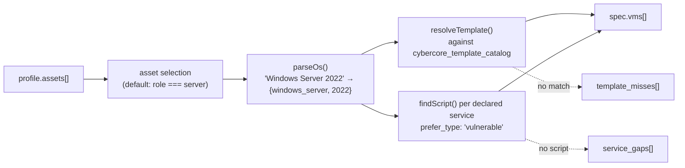
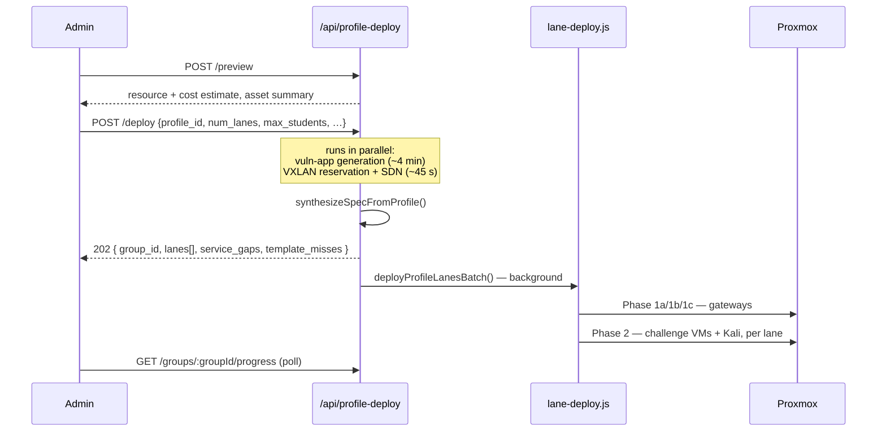
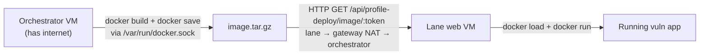

# 08 – Lane Deployment

The bridge from CiaB into the core platform: an admin turns one profile into
N independent Proxmox lanes, each running the profile's servers with a
generated vulnerable web app on top. Classroom mode – 25 students, 25 identical
copies of the same fictional company.

Console: `/ciab/admin-profile-lanes`. API:
[routes/profile-deploy.js](https://github.com/Saguaros-CyberHub/CyberCore/blob/main/front-end/modules/crucible/plugins/ciab/routes/profile-deploy.js)
at `/api/profile-deploy` (admin-only, except the token-gated image pull).
Orchestration:
[utils/lane-deploy.js](https://github.com/Saguaros-CyberHub/CyberCore/blob/main/front-end/modules/crucible/plugins/ciab/utils/lane-deploy.js).

This doc assumes familiarity with
[Overview / 05 – Lanes & Provisioning](../../Overview/05-lanes-and-provisioning.md)
and [06 – Networking](../../Overview/06-networking.md).

## What deploys, and what doesn't

Only assets tagged `role: 'server'` become real VMs by default. Workstations,
mobile devices, printers and IoT stay phantom – they exist in the profile
JSON, the scan documents and the risk assessment, but never on Proxmox. That's
deliberate: a 220-employee school district would otherwise need 200+ VMs per
lane. Admins can tick additional assets in the console.

Two special cases in
[utils/profile-to-spec.js](https://github.com/Saguaros-CyberHub/CyberCore/blob/main/front-end/modules/crucible/plugins/ciab/utils/profile-to-spec.js):

- **Web servers are forced to Linux.** The vuln-app install script uses Docker
  and `apt`; if the AI gave you a Windows `web-01`, the OS is overridden so
  the bake scripts work and you don't end up with a redundant standalone app VM.
- **No web server ⇒ a synthetic one.** If the profile has no web-server asset,
  a `vuln-app` VM is appended from template 1005 (the baked Debian +
  Docker + Apache + PHP + SQLite "web-01" template). It's given `role: 'server'`
  rather than `'web'` so the lane's `/etc/hosts` builder registers it under the
  company domain.

## Synthesis

`synthesizeSpecFromProfile()` is a pure function – callers pre-fetch the
catalogs and pass them in, which is why it has unit tests.



The two report arrays are the point of the design – the admin sees *what won't
deploy and why* before spending an hour of cluster time:

| Report | Reason codes |
|---|---|
| `template_misses` | `unparseable_os`, `no_family_match` |
| `service_gaps` | one entry per `{vm, service, port}` with no matching vuln script |

VM offsets follow the platform-wide convention `600000 + index * 10000`.
Post-clone scripts always start with `init-setup` if its `os_target`
matches – it's Windows-only PowerShell, and running it on Linux fails every
guest-agent exec call.

The emitted spec:

```jsonc
{
  "vxlan_block":  { "start": 10000, "end": 10024 },
  "subnet_scheme": "v2",
  "template_node": "cyberhub-node-5",
  "attack_boxes": true,
  "vms": [ { "name": "dc01", "template_vmid": 1701, "type": "qemu",
             "vm_offset": 600000, "role": "server",
             "services": ["445/SMB"], "post_clone_scripts": ["init-setup","smb-vuln"] } ],
  "vuln_app_install": { "target_vm": "web01", "mode": "docker", … }
}
```

## Deploying



`POST /deploy` returns 202 immediately with the group id; the batch runs in
the background. Constraints: `num_lanes` 1–100, `max_students` ≥ `num_lanes`
and ≤ 200, `subnet_scheme` one of `v1`/`v2`/`v3` (default `v2`).

`max_students` reserves a VXLAN slice larger than the current lane count so
lanes can be added later without renumbering. `GET
/profiles/:profileId/reservation` reports "12 of 25 slots used" and tells the
UI whether to enable *Add lanes*.

### Reservation and the ephemeral challenge

CiaB deploys need a `crucible_challenge` row to hang the spec off, but nobody
creates one through the normal `/create-lab` flow. `getOrCreateProfileChallenge()`
synthesizes one per profile, keyed deterministically, and stores its id on
`ciab_profile_lane_groups.ephemeral_challenge_id`.

Spec adoption on re-deploy is deliberately careful:

| Situation | Behavior |
|---|---|
| New reservation | Persist the freshly synthesized spec |
| Existing reservation, stored spec empty | Adopt fresh regardless of live lanes – keeping an empty spec just re-breaks the deploy |
| Existing reservation, 0 live lanes | Adopt fresh – the admin may have changed the asset selection since a failed attempt |
| Existing reservation, live lanes | Keep the stored spec – changing VM offsets or templates now would collide with running lanes |

### Batch phases

Phases mirror `admin.js /deploy-group`, including the LXC-lock workaround:

| Phase | Work |
|---|---|
| 1a | Replicate the gateway template to each unique target node |
| 1b | Clone N gateway LXCs in parallel from the node-local copies |
| 1c | Delete the temporary template copies |
| 2 | Clone challenge VMs (+ optional Kali) per lane via `runBatch` |

Before Phase 1, `ensureSdnZoneAndVnets()` provisions the SDN zone and VNets for
the whole batch at once, so the per-lane VNet resolution is a plain lookup.
Lanes are spread with `distributeAcrossNodes()`, falling back to
`selectBestNode()` per lane if that fails.

Per-lane failures do not abort the batch. Each lane is a
`ciab_profile_lane_jobs` row moving through
`pending → cloning → firstboot → active`, or landing in `error` with
`error_msg`. `vm_ids[]` records the expected Proxmox VMIDs so retry knows what
to force-destroy first. The group ends `active`, `partial`, or `error`.

### Group management

| Endpoint | Purpose |
|---|---|
| `POST /preview` | Pre-flight resource + cost estimate; reports whether the vuln app is already cached |
| `POST /deploy` | Start a batch (202) |
| `GET /groups` · `GET /groups/:groupId` | List / inspect groups |
| `GET /groups/:groupId/progress` | Live phase, per-lane status, ETA |
| `POST /groups/:groupId/add-lanes` | Grow a group within its reservation |
| `POST /groups/:groupId/retry/:laneId` | Force-destroy the lane's VMIDs and re-run `deployOneLaneFromSpec()` |
| `DELETE /groups/:groupId` | Tear down every lane in the group |
| `GET /profiles/:profileId/reservation` | Reservation / slot usage |

Deployed IPs are written back per-lane into
`ciab_profile_lane_groups.lane_ip_writeback` as
`{ hostname: { lane_id: ip } }`, so the profile can show what's live where.

## The vulnerable app

Every deploy gets an AI-generated vulnerable web app themed to the client
organization – a dental clinic gets a patient portal, a utility gets an outage
dashboard.

### Generation (3 stages)

[ai/vuln-app/index.js](https://github.com/Saguaros-CyberHub/CyberCore/blob/main/front-end/modules/crucible/plugins/ciab/ai/vuln-app/index.js):

| Stage | Calls | Produces |
|---|---|---|
| 1 · Concept design | 1 | App spec: 5–10 themed pages, a 3–5 stage attack chain, tech stack matched to the company. Temperature 0.8 for variety. |
| 2 · File generation | 1 per page, parallel | The actual source tree |
| 3 · Install generation | 1 | Dockerfile + install script |

Stage 2 overrides the global concurrency cap because each call emits up to
~8 K output tokens and an 8-file fan-out at the default cap exhausts a Tier-1
output budget in seconds. Tunable by env var:

| Variable | Default | Purpose |
|---|---|---|
| `CIAB_VULN_APP_FILE_CONCURRENCY` | 2 | Parallel page generations |
| `CIAB_VULN_APP_FILE_MAX_TOKENS` | 8192 | Per-page output ceiling |
| `CIAB_VULN_APP_FILE_RETRY_MAX_TOKENS` | 16384 | Retry ceiling for pages flagged as truncated – re-running at the same cap just truncates again |

Post-processing in
[utils/vuln-app-builder.js](https://github.com/Saguaros-CyberHub/CyberCore/blob/main/front-end/modules/crucible/plugins/ciab/utils/vuln-app-builder.js)
repairs Node source trees, detects missing relative imports (synthesizing a
repair page for each), and injects the base stylesheet.

Results persist to `ciab_profile_vuln_apps` and are reused across deploys of
the same profile, so the LLM cost is paid once. If `ANTHROPIC_API_KEY` is
missing or the pipeline fails,
[utils/vuln-app-generator.js](https://github.com/Saguaros-CyberHub/CyberCore/blob/main/front-end/modules/crucible/plugins/ciab/utils/vuln-app-generator.js)
falls back to a hardcoded vulnerable-PHP template so the deploy path still
works end to end.

### Build and delivery



Lane subnets have no reliable outbound internet – no UDP 53, no registry
egress – so `docker build` on the lane VM is fragile. Instead the
orchestrator builds the image while gateways clone in Phase 1, saves it as a
gzip tarball, and the lane pulls the ready image over the existing
lane→orchestrator NAT path. The QEMU guest agent only carries a tiny
`wget + docker load + docker run` command rather than a slow base64 file
transfer.

`ensureVulnImage()` returns its input unchanged if Docker is unavailable or the
build fails, so the legacy on-VM build path remains the fallback.

The image endpoint is unauthenticated by necessity (lane VMs have no JWT) but
is gated three ways: an opaque token, a source-IP check restricting callers to
lab ranges including `100.64/10` CGNAT, and mount ordering that keeps the
`/api` catch-all from claiming the route ([01](01-architecture.md)).

!!! danger "Docker socket exposure"
    The build engine is DooD – `docker build` against the orchestrator VM's
    daemon through the `/var/run/docker.sock` mount declared in
    `docker-compose.yml`. Anything with code execution inside the app
    container can reach orchestrator-VM root via `docker run -v /:/host`.
    Mitigations in place: dependency hygiene, no `shell: true` on spawns,
    OPNsense in front of the orchestrator, and admin-only gating on every
    build-triggering feature.

    Kaniko was evaluated as a daemonless alternative and reverted – it extracts
    each build's base image into `/`, clobbering the running app container's
    own binaries and breaking deploys deterministically.

## Networking

[utils/lane-networking.js](https://github.com/Saguaros-CyberHub/CyberCore/blob/main/front-end/modules/crucible/plugins/ciab/utils/lane-networking.js)
holds CiaB-local copies of the subnet math and gateway constants:

| Constant | Value |
|---|---|
| v2 lane gateway template | VMID 1694 |
| v3 lane gateway template | VMID 1695 |
| Kali template | VMID 1699 |
| Attack-box VMID offset | 700000 |
| v3 internal tag offset | 4000000 |

Default scheme is v2 (subnet-agnostic `10.x.x.x` lanes), which is where
CiaB servers actually live. v3 is honored if explicitly requested, but no GOAD
provisioning happens on this path.

!!! warning "Deliberate duplication"
    These helpers are mirrored from `src/routes/admin.js` and kept in sync
    manually, so the plugin stays self-contained if a future refactor
    removes them from `admin.js`. Change one, change the other. The long-term
    fix is to move them to `src/utils/lane-networking.js` and have both callers
    import the shared copy.

Continue to **[09 – Data Model](09-data-model.md)**.
