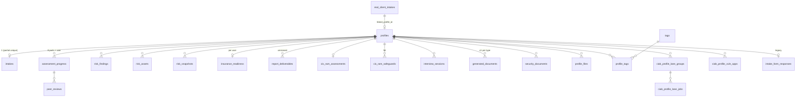

# 09 – Data Model

Everything here lives in `clinic_db`, provisioned by the module loader from
the plugin's `database` manifest block and migrated from
[migrations/](https://github.com/Saguaros-CyberHub/CyberCore/tree/main/front-end/modules/crucible/plugins/ciab/migrations/).

Two rules apply throughout:

- **No `users` table.** Users live in `cybercore_db.cybercore_user`. Every
  `user_id` / `instructor_id` / `student_id` / `reviewer_id` column here is a
  bare UUID with no foreign key – cross-database references can't be
  enforced by Postgres.
- **Lane and challenge ids are bare UUIDs too.** `crucible_challenge` and
  `cybercore_lane` live in `cybercore_db`, so the same limit applies.

## Migrations

| File | Adds |
|---|---|
| `001_ciab_schema.sql` | Base schema – profiles, progress, documents, interviews, instructor tables, deploy scaffolding, 3 views |
| `002_real_client_intake.sql` | `real_client_intakes`; `profiles.profile_source` / `source_intake_id` / `filler_assets` |
| `003_unify_intakes.sql` | `intakes` (canonical) + idempotent backfill from `real_client_intakes` |
| `004_clinic_risk_assessment.sql` | `risk_findings`, `report_deliverables` |
| `005_cis_ram.sql` | `cis_ram_assessments`, `cis_ram_safeguards` |
| `006_profile_lane_deploys.sql` | `ciab_profile_lane_groups`, `ciab_profile_lane_jobs`, `ciab_profile_vuln_apps` |
| `007_risk_assessment_tier1_3.sql` | `risk_assets`, `threat_scenario_library`, `risk_snapshots`, `insurance_readiness`; extends `risk_findings` and `report_deliverables` |

Migrations 002 and 007 use `DO $$ … $$` blocks with existence checks so
re-running is safe – `ADD COLUMN IF NOT EXISTS` doesn't re-check constraints.

## Entity map

Almost every child table is `ON DELETE CASCADE` from `profiles` – deleting a
profile takes its findings, intakes, sessions and lane groups with it.
`instructor_assignments.profile_id` is `ON DELETE SET NULL` instead, so the
assignment record survives.

## Core

### `profiles`

The hub. Summary columns only; the full document is the JSON file at
`json_file_path`.

| Column group | Columns |
|---|---|
| Identity | `id`, `run_id` (unique), `user_id`, `company_name`, `hq_city`, `industry` |
| Classification | `client_type`, `client_type_name`, `difficulty`, `maturity_level`, `delivery_mode`, `profile_type`, `scaffolding_level` |
| Scale | `employee_count`, `stakeholder_count`, `endpoint_count` |
| Content (JSONB) | `compliance_frameworks`, `key_risks`, `critical_systems`, `nice_alignment`, `instructor_materials`, `student_worksheets`, `artifacts`, `learning_objectives`, `grading_rubric`, `difficulty_settings` |
| Files | `html_filename`, `json_filename`, `html_file_path`, `json_file_path`, `file_size_bytes` |
| Generation | `generation_status`, `generation_time_seconds` |
| Provenance (002) | `profile_source` (`ai_simulated` \| `real_intake`), `source_intake_id` → `real_client_intakes`, `filler_assets` |

Indexed on user, client type, company name, industry, status, scaffolding,
created_at, source – plus a GIN full-text index over
`company_name + industry + hq_city`.

### `assessment_progress`

One row per `(user_id, profile_id, part_number)` – the unique constraint that
makes the upsert in `PUT /api/progress/...` work. Holds `content`,
`content_format`, `evidence_files`, `status`, `revision_count`, plus review
fields (`reviewer_id`, `feedback`, `score`, `rubric_scores`, `reviewed_at`).
Instructor answer keys are stored here too, as the instructor's own rows.

### `intakes` (canonical)

`profile_id` is nullable with a partial unique index where not null – one
intake per profile, unlimited standalone uploads. `source` is `ai_simulated` or
`real_client`; `status` is `in_progress` or `complete`;
`completion_percentage` is 0–100. `legacy_source_table` / `legacy_source_id`
carry audit provenance from the backfill.

See [03 – Intakes](03-intakes.md) for the payload shape and the two legacy
tables (`intake_form_responses`, `real_client_intakes`).

## Risk assessment

| Table | Notes |
|---|---|
| `risk_findings` | `inherent_risk` is a generated stored column (`likelihood * impact`). Unique on `(profile_id, finding_code)`. Extended by 007 with ownership, evidence, OWASP, FAIR and asset-linkage columns |
| `risk_assets` | Asset register – CIA 1–3, `criticality_tier` 1–3, `data_classification`, `containers` |
| `threat_scenario_library` | System-wide, keyed by slug. Seeded lazily from JSON |
| `risk_snapshots` | Frozen counts, IG1 split, CSF scores, totals, plus the full `findings_snapshot` |
| `insurance_readiness` | 12 control flags + computed `readiness_score` / `readiness_tier`. Unique on `(profile_id, user_id)` |
| `report_deliverables` | Unique on `(profile_id, version)`. `charts_cache` holds client-rendered PNGs; `exec_*` columns hold the structured summary |
| `cis_ram_assessments` | One per profile (unique). `acceptable_risk_score` 1–9 |
| `cis_ram_safeguards` | 56 per profile, unique on `(profile_id, safeguard_num)`. Both risk scores are generated stored columns |

## Instruction

| Table | Purpose |
|---|---|
| `instructor_assignments` | Instructor → student → profile, with `due_date`. Unique on the triple |
| `instructor_working_sets` | Soft-delete watch list (`is_active`, `removed_at`); partial index on active rows |
| `peer_reviews` | Student-to-student review keyed on `(submission_id, reviewer_id)`. Schema exists; not exercised by current routes |
| `nice_framework_reference` | NICE work-role / competency catalog (string PK) |
| `nice_progress` | Demonstrated competencies, unique on `(user_id, work_role_id, competency_type, competency_id)` |

## Documents

| Table | Purpose |
|---|---|
| `generated_documents` | Unique on `(profile_id, document_type)` where type ∈ `nessus`, `zap`, `nmap`, `combined`, `policies`. Content stored inline |
| `security_documents` | Instructor-generated documents with severity counts and sharing flags |
| `document_access_log` | Who opened what, when |
| `profile_files` | Files attached to a profile, with checksum and FTP-upload state |

## Deployment

| Table | Purpose |
|---|---|
| `ciab_profile_lane_groups` | One per batch deploy – `num_lanes`, `asset_selection`, `service_gaps`, `template_misses`, `profile_snapshot` (frozen assets), `lane_ip_writeback`, `ephemeral_challenge_id`, `subnet_scheme`, `status` |
| `ciab_profile_lane_jobs` | One per lane – `lane_id`, `vxlan_id`, `lane_index`, `status`, `phase_detail`, `error_msg`, `vm_ids[]`, `target_node`. Unique on `(group_id, lane_index)` |
| `ciab_profile_vuln_apps` | Cached generated app – `dockerfile`, `source_tree`, `install_script`, `llm_model`, `generation_meta`. Multiple rows per profile; readers take the newest |
| `challenge_templates` | Reusable VM-spec templates |
| `vuln_scripts` | Post-clone vulnerability scripts – `slug` (unique), `script_type` (`baseline` \| `vulnerable`), `os_target`, `services_exposed`, `depends_on` |
| `deployment_vuln_selections` | Which scripts were chosen for a lane |
| `deployed_groups` · `account_schedules` | Classroom groups (`config` JSONB with `students[]`/`instructors[]`) and their access windows |

## Misc

`activity_log`, `sessions`, `tags`, `profile_tags`, `favorites`.

`sessions` in `clinic_db` predates unified auth; live authentication is handled
by CyberCore ([Overview / 08](../../Overview/08-auth-and-security.md)).

## Views

| View | Returns |
|---|---|
| `profile_listing` | Profiles with user columns as typed NULLs – users live in another database, so joins happen at the app layer |
| `v_interview_summary` | Per `(user, profile)`: interview counts, question totals, average quality, stakeholders interviewed |
| `v_student_progress_summary` | Per `(user, profile)`: parts started / submitted / reviewed, average score, last activity. Email and role are typed NULLs for the same reason |

## Tables that exist in both databases

`deployed_groups`, `account_schedules`, `generated_documents`,
`instructor_working_sets` and `vuln_scripts` also exist in `cybercore_db`.
CiaB always uses the `clinic_db` copies. Check `\c` before concluding a row is
missing.

Continue to **[10 – API Reference](10-api-reference.md)**.
